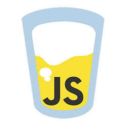
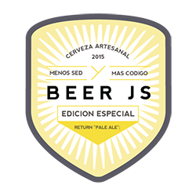
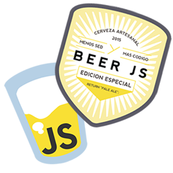

# BeerJS Santiago

Encuentro JavaScripters + cerveceros en Santiago

[beerjs.cl](http://www.beerjs.cl/)

## ¿Qué?

BeerJS es un encuentro de desarrolladores apasionados por crear código JavaScript día-a-día y que disfrutan de una buena cerveza.

Se realiza mundialmente, por ciudades, y cada 30 días le toca a Santiago albergar una propia en un bar/oficina central y accesible a todos los asistentes.

### Juntarse

Somos humanos que escribimos código que sólo las máquinas interpretan. Pero queremos volver a las raíces para sociabilizar por un par de horas. Salir de las oficinas, casas o cuevas donde se encuentren y compartir los problemas que nos dan los proyectos.

### Compartir

Ya en el lugar, todos los inscritos tendrán la oportunidad de compartir sobre un tema definido para cada encuentro. Podrán por breves minutos mostrar su experiencia para que todos opinemos y exploremos lo presentado.

### Beber y comer

Mientras tanto probaremos diferentes tipos de cervezas traídas por los mismos asistentes y la comida será definida y auspiciada según el lugar.

## Auspicios

#### ¿Te gustaría apoyar BeerJS?

¿Buscas desarrolladores para tu empresa? En BeerJS se juntan los mejores de la ciudad, auspicia un encuentro en tu oficina y conócelos.

¿Eres parte de una empresa donde trabajan con JavaScript? Auspicia un encuentro y deja que tus desarrolladores compartan con nosotros.

¿Tienes una empresa cool? Muéstrala auspiciando un encuentro y conversemos cómo enfrentas tus proyectos.

[Escríbenos](mailto:salud@beerjs.cl)

## Próximo Encuentro:

[beerjs.cl](http://www.beerjs.cl/)

## ¡Stickers!

Lleva stickers oficiales **BeerJS** y lúcelo en tu computador o dónde quieras.

Pago fácil por *PayPal* y envío a todo Chile por correo certificado.

### 4 stickers vaso: *US$7*

- 4 stickers vaso BeerJS
- Tamaño: 5 X 6,5 cms.
- Envío incluído a todo Chile

<form action="https://www.paypal.com/cgi-bin/webscr" method="post" target="_top">
  <input type="hidden" name="cmd" value="_s-xclick">
  <input type="hidden" name="hosted_button_id" value="NJMYVCVT6BW7N">
  <input type="image" src="https://www.paypalobjects.com/en_US/i/btn/btn_buynowCC_LG.gif" border="0" name="submit" alt="PayPal - The safer, easier way to pay online!">
  
</form>

### 4 stickers botella: *US$9*

- 4 stickers botella BeerJS
- Tamaño: 7,5 X 8,7 cms cms.
- Envío incluído a todo Chile

<form action="https://www.paypal.com/cgi-bin/webscr" method="post" target="_top">
  <input type="hidden" name="cmd" value="_s-xclick">
  <input type="hidden" name="hosted_button_id" value="FRKJQFYBEDEAU">
  <input type="image" src="https://www.paypalobjects.com/en_US/i/btn/btn_buynowCC_LG.gif" border="0" name="submit" alt="PayPal - The safer, easier way to pay online!">
  
</form>

### 6 stickers mixtos: *US$12*

- 3 stickers vaso BeerJS (5 X 6,5 cms.)
- 3 stickers botella BeerJS (7,5 X 8,7 cms.)
- Envío incluído a todo Chile

<form action="https://www.paypal.com/cgi-bin/webscr" method="post" target="_top">
  <input type="hidden" name="cmd" value="_s-xclick">
  <input type="hidden" name="hosted_button_id" value="X8RGM6FMFXB5G">
  <input type="image" src="https://www.paypalobjects.com/en_US/i/btn/btn_buynowCC_LG.gif" border="0" name="submit" alt="PayPal - The safer, easier way to pay online!">
  
</form>

## Organiza

Jorge Epuñan H. [Twitter](http://www.twitter.com/csslab)

> Creador de código para humanos y máquinas. Y browsers también. Tomé la idea de BeerJS y la traje a Santiago. Y la organizo mes a mes. Por que me gusta JavaScript y la cerveza.

---

BeerJS ayuda a crear espacios sociales que fortalezcan comunidades alrededor del software. No es requerimiento alguno consumir alcohol para participar.

[Código de Conducta](http://es.confcodeofconduct.com/)

Sigue en [Twitter](http://twitter.com/intent/follow?original_referer=&screen_name=BeerJSSantiago&tw_p=followbutton&variant=2.0)

Participa, aporta en [Slack](http://www.devschile.cl/)
